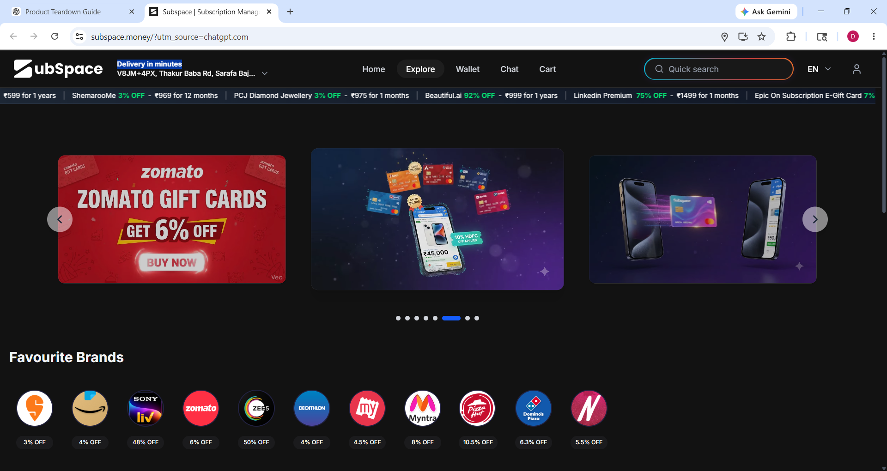
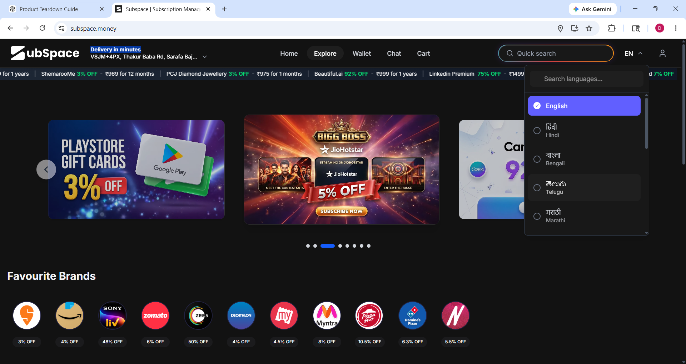

Product Teardown – Subspace.money
Name: Deekshant Moorjani
Role Applied: Product Intern
Date: 31 May 2026

# why I choose Subspace
I chose Subspace because it operates in a difficult but high-frequency consumer problem space: recurring payments, subscription sharing, and expense management. The product already demonstrates strong operational 
leverage with AI automation and profitability, which makes the next stage of growth heavily dependent on product clarity, trust, retention, and network effects.
The teardown below focuses on:
GTM & ICPs
Competitor positioning
Features & services
UX
Collaboration opportunities
I intentionally focused on practical, execution-ready observations rather than generic feature suggestions.

## Feedback 1 : The Homepage Explains the Product, But Not the Outcome

a. Observed = When I first visited the website, I understood that Subspace is related to subscription management and sharing. However, it took some time to understand exactly how it would help me as a user.
The homepage talks about the platform, but it does not immediately show the main benefit a user gets from using it.

b. Problem = Most users do not search for a “subscription management platform.” They are usually trying to:
Save money on subscriptions
Split OTT costs with friends
Avoid unwanted renewals
Manage recurring payments easily
If the value proposition is not clear within the first few seconds, some users may leave before exploring further.

c. Ship Instead = I would make the homepage more outcome-focused.
For example: “Save money on subscriptions by sharing and managing them smarter.”
I would also show:
Estimated savings users can achieve
Real examples of shared subscriptions
A simple visual explaining how the product works
This would make the value of the product easier to understand immediately.

## Feedback 2 : Login Appears Before Trust Is Fully Built

a. observed = While exploring the product, I noticed that users are encouraged to log in quite early.
Before signing up, there is limited opportunity to understand how subscription sharing works or what protections are available for users.

b. Problem = Since the platform deals with subscriptions, payments, and shared plans, trust is very important.
A new user may have questions such as:
Is this safe to use?
How does subscription sharing work?
What happens if someone leaves the group?
How are payments managed?
If these questions are not answered before signup, users may hesitate to continue.

c. Ship Instead = I would introduce an “Explore Before Login” experience.
Users should be able to:
Browse available subscriptions
View estimated savings
Understand how sharing works
See trust and safety information
This would help reduce hesitation and improve signup conversion.

## Feedback 3 : Limited Language Localization Opportunity

a. observed = The platform supports several Indian languages, which is a positive step. However, India has a very diverse user base, and some language communities may still feel underserved.
For example, users from communities such as Sindhi speakers may not find support for their preferred language.

b. Problem = Subspace positions itself as an India-first product.
As the platform expands into Tier-2 and Tier-3 cities, language accessibility becomes increasingly important.
Users often trust and engage more with products that support their preferred language.

c. Ship Instead = I would create a phased localization roadmap based on user demand and usage data.
Possible improvements:
Additional regional language support
Hinglish mode
Language request/voting feature
Voice-guided onboarding in local languages
This would help make the product more accessible to a wider audience across India.

## Feedback 4 : Missing a Reward System for User Engagement

a. observed = While exploring the platform, I did not notice any rewards, points, achievements, or incentive-based engagement features.
The experience feels mostly transactional.

b. Problem = Subscription management is not something users interact with every day.
A user may set up their subscriptions once and then have very little reason to return regularly.
This can affect user engagement and retention over time.

c. Ship Instead = I would introduce a simple rewards program called Subspace Rewards.
Examples:
Points for inviting friends
Rewards for creating sharing groups
Cashback or coupons from partner brands
Apps like PhonePe and Google Pay use rewards successfully to encourage repeat engagement.
A similar system could give users more reasons to revisit the platform.

## Feedback 5 : Strong Opportunity for Student and Telecom Partnerships

a. observed = Subspace already focuses on subscriptions, sharing, and recurring payments, which are highly relevant to students and families.
However, I did not notice many partnership-driven growth initiatives highlighted in the product experience.

b. Problem = Acquiring users directly in the consumer fintech space can be expensive.
At the same time, students are one of the most likely groups to share subscriptions and split costs.
Without strong distribution partnerships, growth may depend heavily on direct marketing.

c. Ship Instead = I would explore partnerships with:
Universities and colleges
Student communities
Telecom providers such as Jio and Airtel
OTT and digital subscription providers
For example, a student could receive exclusive subscription-sharing benefits through a college partnership.
This could create a low-cost acquisition channel while also strengthening the platform's network effects.

## Competitor Analysis

CRED : Strong brand(better subscription focus) 
Splitwise : Expense splitting(subscription intelligence)
PhonePe : Rewards ecosystem(subscription marketplace)

## Final Thoughts
After exploring Subspace.money, I believe the product is solving a genuine and growing problem. The idea of managing subscriptions, reducing costs, and enabling sharing has strong potential, especially in the Indian market.
My main focus would be improving:
Value proposition clarity
User trust during onboarding
Engagement and retention
Localization
Distribution through partnerships
Rather than adding many new features, I believe improving these areas would create a stronger user experience and support long-term growth.
